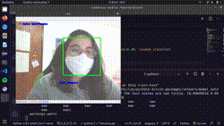

# Reconhecendo máscaras

    

Este repositório contém um script em Python3 que reconhece se um rosto está ou não portando uma máscara!

O código utiliza da biblioteca OpenCV para o processamento das imagens e scikit-learn para o treinamento do modelo que classifica um rosto que porta ou não uma máscara. 

O conjunto de imagens utilizadas para o treinamento do modelo pode ser encontrada na pasta [imagens](./imagens) e foi retirado desse [link](https://github.com/sandeco/CanalSandeco/tree/master/Deep%20Learning%20s%C3%A9rie/%2316%20-%20Detectando%20Faces%20em%20v%C3%ADdeo%20com%20Deep%20Learning).

#### Mais sobre o código

Em [open_cam.py](./open_cam.py) temos um script que viabiliza que a webcam do seu computador seja iniciada. 

Nesse script carregamos um dataframe partindo do conjunto de imagens que temos e treinamos um modelo [K-Nearest Neighbor](https://medium.com/brasil-ai/knn-k-nearest-neighbors-1-e140c82e9c4e) para classificar os rostos.

Para o reconhecimento genérico das faces, utiliza-se o [CascadeClassifier](https://docs.opencv.org/3.4/db/d28/tutorial_cascade_classifier.html), já incluso dentro da biblioteca do OpenCV. De modo geral, esse método de treinamento utiliza de um arquivo .xml, que também já é incluso no pacote, para treinar um modelo que reconheça rostos de forma genérica, utilizando o método [Viola-Jones](https://en.wikipedia.org/wiki/Viola%E2%80%93Jones_object_detection_framework) e [AdaBoost](https://towardsdatascience.com/boosting-algorithm-adaboost-b6737a9ee60c) para o melhoramento do desempenho.

O algoritmo de Machine Learning escolhido para classificação foi o K-Nearest Neighbor, pois foi o que apresentou melhor desempenho diante o conjunto de teste e de validação. A ideia é que, em um próximo experimento, esse mesmo código possa ser refeito utilizando uma CNN!

#### Alguns links

Aqui vou deixar uns links de referência com o que pesquisei sobre o assunto para desenvolver o código!

- [Documentação do OpenCV](https://docs.opencv.org/master/)
- [Documentação do scikit-learn](https://scikit-learn.org/stable/)
- [Playlist de Python + OpenCV do canal Universo Discreto](https://www.youtube.com/watch?v=oAH_GJclePY&list=PL-t7zzWJWPtx3enns2ZAV6si2p9zGhZJX)
- [Detectando Faces em Vídeo com Deep Learning (vídeo do dono do repositório de onde tirei o conjunto de dados)](https://www.youtube.com/watch?v=7Roghby6f24&t=461s)
- [Reconhecimento de Faces | Redes Neurais em PyTorch | Programando em 10 minutos (Peixe Babel)](https://www.youtube.com/watch?v=s2Nr8nHK66c&t=903s)